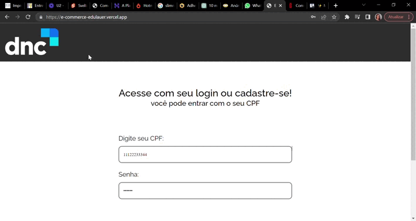

<h1 id="início">
  Desafio e-commerce DNC
</h1>

A DNC propos o desenvolvimento de uma aplicação web utilizando o React como framework. 

## Índice

* [1. Sobre o projeto](#1-sobre-o-projeto)
* [2. Resultado do projeto](#2-resultado-do-projeto)
* [3. Guia de instalação](#3-guia-de-instalação)
* [4. Tecnologias utilizadas](#4-tecnologias-utilizadas)
* [5. Implementações Futuras](#5-implementações-futuras)
* [6. Autor do projeto](#6-autora-do-projeto)

## 1. Sobre o projeto

O e-commerce é uma ótima oportunidade de aumentar a lucratividade da empresa, pois oferece uma experiência de compra conveniente, rápida e segura, o que os torna uma escolha popular para muitos consumidores. 

Para o planejamento do projeto, utilizei a ferramenta trello para estruturar as atividades que deveriam ser feitas por etapas e suas dependencias.

Principais objetivos: 

   - Compreender o funcionamento de uma plataforma de comércio eletrônico 
  
   - Saber personalizá-la para atender as necessidades específicas do seu 	   negócio.

   - Saber oferecer uma experiência de compra intuitiva e fácil de usar, com base nas necessidades do seu usuário
  
   - Saber desenvolver um projeto utilizando as principais ferramentas front-end do mercado: HTML, CSS, JavaScript e React.JS.
  
  
 O _boilerplate_ foi estruturado de acordo com as funcionalidades do projeto e seus componentes.

 O projeto foi desenvolvido com **React e JavaScript**.

 ## 2. Resultado do projeto

 Seguindo fielmente o layout fornecido, criei os componentes conforme os tópicos necessários.
O site também é responsivo.
 Confira abaixo como ficou a aplicação!

 

 

## 3. Guia de Instalação
Você também pode testar e manipular o projeto localmente, basta seguir os seguintes passos:

Para clonar o projeto, abra seu terminal, digite o seguinte comando abaixo e aperte enter:

      git clone https://github.com/edu-lauer/e-commerce.git
  
Feito isso, ainda no terminal, entre na pasta clonada e digite o seguinte comando:

      npm install  
    

Agora vamos rodar a aplicação! Digite no terminal:
        
      npm start
      

Prontinho! Você já pode usar o projeto.       

## 4. Tecnologias utilizadas

* [React](https://react.dev/)
* [JavaScript](https://www.javascript.com/)
* [Sass](https://sass-lang.com/)
* [JavaScript](https://developer.mozilla.org/pt-BR/docs/Web/JavaScript)
* HTML 5
* [Vite](https://vitejs.dev/)
* [React Router](https://reactrouter.com/en/main)
* Git e GitHub
* [Visual Studio Code](https://code.visualstudio.com/)

Escolhi utilizar o framework React, pois é o framework que estou aprendendo no curso e o projeto foi oritentado a ser feito em React.

Optei por utilizar o Vite para iniciar o projeto devido sua agilidade e também  **nos poupa muito tempo configurando outras bibliotecas**

  
## 5. Implementações Futuras
      
Em futuras implementações, para a melhoria e desempenho do projeto, desejo realizar os seguintes pontos:

  - Melhor performance da aplicação.
  - Acessibilidade
  - Optimização e melhoria na responsividade.
  - Melhoria na questão de validações e tratamentos de erros.

## 6. Autora do projeto

👩‍💻 Projeto desenvolvido por:

  <table>
    <thead>
      <tr>
        <th align="center">Eduardo Lauer</th>
      </tr>
    </thead>
    <tbody>
      <tr>
        <td align="center">
          <a href="#">
             
          </a>
        </td>
      <tr>      
        <td align="center">
          
          
        </td>
       </tr>
    </tbody>s
  </table>

  <a href="#início">
  ⬆ Voltar ao início
 </a>

